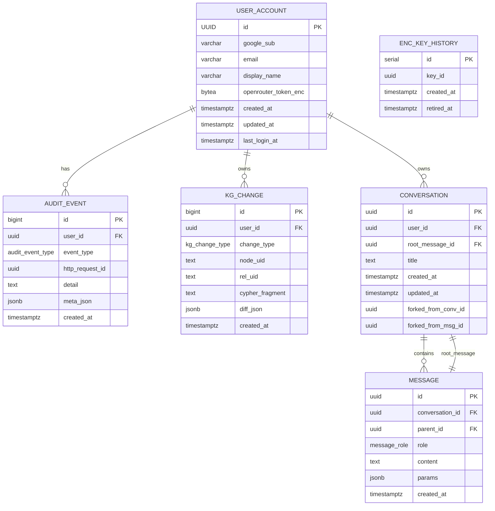

# Chatbot Relational Schema with Forkable Conversations

This document defines the PostgreSQL schema and data model for a multi-user,
auditable, forkable chat application designed to integrate with a knowledge
graph and external LLM inference providers.

## Entity-Relationship Diagram

The following MermaidJS diagram captures the high-level structure of users,
audit logs, knowledge graph changes, and conversations/messages:



## PostgreSQL Schema Definition (DDL)

```sql
-- ENUM TYPES
CREATE TYPE audit_event_type AS ENUM (
  'CHAT_REQUEST', 'CHAT_RESPONSE', 'KG_UPDATE_ENQUEUED', 'KG_UPDATE_APPLIED', 'AUTH', 'ERROR'
);

CREATE TYPE kg_change_type AS ENUM (
  'NODE_CREATED', 'NODE_UPDATED', 'REL_CREATED', 'REL_UPDATED', 'REL_DEACTIVATED'
);

CREATE TYPE message_role AS ENUM ('user', 'assistant', 'system');

-- USER ACCOUNT
CREATE TABLE user_account (
  id UUID PRIMARY KEY DEFAULT gen_random_uuid(),
  google_sub VARCHAR(255) UNIQUE NOT NULL,
  email VARCHAR(255) UNIQUE NOT NULL,
  display_name VARCHAR(255),
  openrouter_token_enc BYTEA,
  created_at TIMESTAMPTZ NOT NULL DEFAULT now(),
  updated_at TIMESTAMPTZ NOT NULL DEFAULT now(),
  last_login_at TIMESTAMPTZ,
  CONSTRAINT chk_email CHECK (email ~* '^[^@]+@[^@]+\\.[^@]+$')
);

-- AUDIT EVENT
CREATE TABLE audit_event (
  id BIGSERIAL PRIMARY KEY,
  user_id UUID REFERENCES user_account(id) ON DELETE CASCADE,
  event_type audit_event_type NOT NULL,
  http_request_id UUID,
  detail TEXT,
  meta_json JSONB,
  created_at TIMESTAMPTZ NOT NULL DEFAULT now()
);
CREATE INDEX idx_audit_user_time ON audit_event(user_id, created_at DESC);

-- KNOWLEDGE GRAPH CHANGE
CREATE TABLE kg_change (
  id BIGSERIAL PRIMARY KEY,
  user_id UUID REFERENCES user_account(id) ON DELETE CASCADE,
  change_type kg_change_type NOT NULL,
  node_uid TEXT,
  rel_uid TEXT,
  cypher_fragment TEXT,
  diff_json JSONB,
  created_at TIMESTAMPTZ NOT NULL DEFAULT now()
);
CREATE INDEX idx_kgchange_user_time ON kg_change(user_id, created_at DESC);

-- ENCRYPTION KEY HISTORY
CREATE TABLE enc_key_history (
  id SERIAL PRIMARY KEY,
  key_id UUID NOT NULL,
  created_at TIMESTAMPTZ NOT NULL DEFAULT now(),
  retired_at TIMESTAMPTZ
);

-- CONVERSATION
CREATE TABLE conversation (
  id UUID PRIMARY KEY DEFAULT gen_random_uuid(),
  user_id UUID REFERENCES user_account(id) ON DELETE CASCADE,
  root_message_id UUID,
  title TEXT,
  created_at TIMESTAMPTZ NOT NULL DEFAULT now(),
  updated_at TIMESTAMPTZ NOT NULL DEFAULT now(),
  forked_from_conv_id UUID,
  forked_from_msg_id UUID
);

-- MESSAGE
CREATE TABLE message (
  id UUID PRIMARY KEY DEFAULT gen_random_uuid(),
  conversation_id UUID REFERENCES conversation(id) ON DELETE CASCADE,
  parent_id UUID REFERENCES message(id) ON DELETE SET NULL,
  role message_role NOT NULL,
  content TEXT NOT NULL,
  params JSONB,
  created_at TIMESTAMPTZ NOT NULL DEFAULT now()
);
CREATE INDEX idx_msg_parent ON message(parent_id);
CREATE INDEX idx_msg_convtime ON message(conversation_id, created_at);
```

## Forkable Conversation Design

A conversation consists of a chain of `message` rows linked by `parent_id`.
Forking a conversation is done by starting a new `conversation` and pointing it
at an existing `message` as its `root_message_id`, and preserving the
`forked_from_conv_id` and `forked_from_msg_id` for metadata.

### **Fork creation:**

```sql
WITH src AS (
  SELECT m.id AS fork_msg_id,
         c.id AS src_conv_id,
         c.user_id
  FROM message m
  JOIN conversation c ON c.id = m.conversation_id
  WHERE m.id = :msg_id
)
INSERT INTO conversation (
      id, user_id, root_message_id,
      forked_from_conv_id, forked_from_msg_id,
      title)
SELECT gen_random_uuid(), user_id, fork_msg_id, src_conv_id, fork_msg_id,
       'Fork of chat '||substr(src_conv_id::text,1,8)
FROM src
RETURNING id;
```

### **Full replay:**

```sql
SELECT role, content FROM message WHERE conversation_id = :conv_id ORDER BY created_at ASC;
```

### **Tail from fork point:**

```sql
WITH RECURSIVE tail(id, role, content) AS (
  SELECT id, role, content
  FROM message
  WHERE id = :fork_point

  UNION ALL

  SELECT m.id, m.role, m.content
  FROM message m
  JOIN tail t ON m.parent_id = t.id
  WHERE m.conversation_id = :conv_id
)
SELECT * FROM tail ORDER BY created_at;
```

This approach ensures full auditability, lineage tracking, and efficient storage
reuse while giving users flexibility to explore alternative continuations of
their conversations.

### Garbage-collection & quotas

Because historic messages may be shared by many branches, **never hard-delete**
rows. Instead:

Then run a nightly job that removes messages *only* when

```sql
NOT EXISTS (
    SELECT 1
    FROM conversation
    WHERE root_message_id = message.id
      OR parent_id = message.id
)
```

### Testing forks

```python
def test_fork_creates_new_branch(pg_session, user_id, base_conv, fork_msg):
    new_conv_id = fork_chat(pg_session, user_id, base_conv, fork_msg)
    # 1. new conv exists
    conv = pg_session.query(Conversation).get(new_conv_id)
    assert conv.forked_from_conv_id == base_conv
    # 2. both conversations reuse the same ancestor count
    base_msgs = pg_session.query(Message).filter_by(conversation_id=base_conv).count()
    fork_msgs = pg_session.query(Message).filter_by(conversation_id=new_conv_id).count()
    assert fork_msgs == 1               # only the fork point so far
    assert base_msgs >= fork_msgs
```

Because the schema is pure SQL and every test spins up **postgresql://:memory:**
via **pytest-postgresql**, no external services are needed.

### Key points

| Design choice Why | | | -------------------------------------------- |
\-----------------------------------------------------------------------------------------------------------------------------------------------------------------------------------------------
| | Immutable `MESSAGE` rows | Once inserted they never change → any message can
safely be shared by multiple branches. | | `parent_id` per branch | Points to
the immediate predecessor *within that conversation*. When you fork, the new
head’s `parent_id` is the old message, so the new branch re-uses the same
ancestry up to the fork point. | | `CONVERSATION.forked_from_*` columns | Pure
metadata: lets the UI show *“Forked from message #n in chat X”* but isn’t needed
for traversal (you can always walk back via `parent_id`). | | `root_message_id`
shortcut | Saves one join when the UI lists threads. | | Shared messages,
distinct conversations | Storage-efficient: historic turns are stored **once**,
yet a forked chat has its own `conversation_id`, making per-branch settings
(model, temperature, visibility) trivial. |
